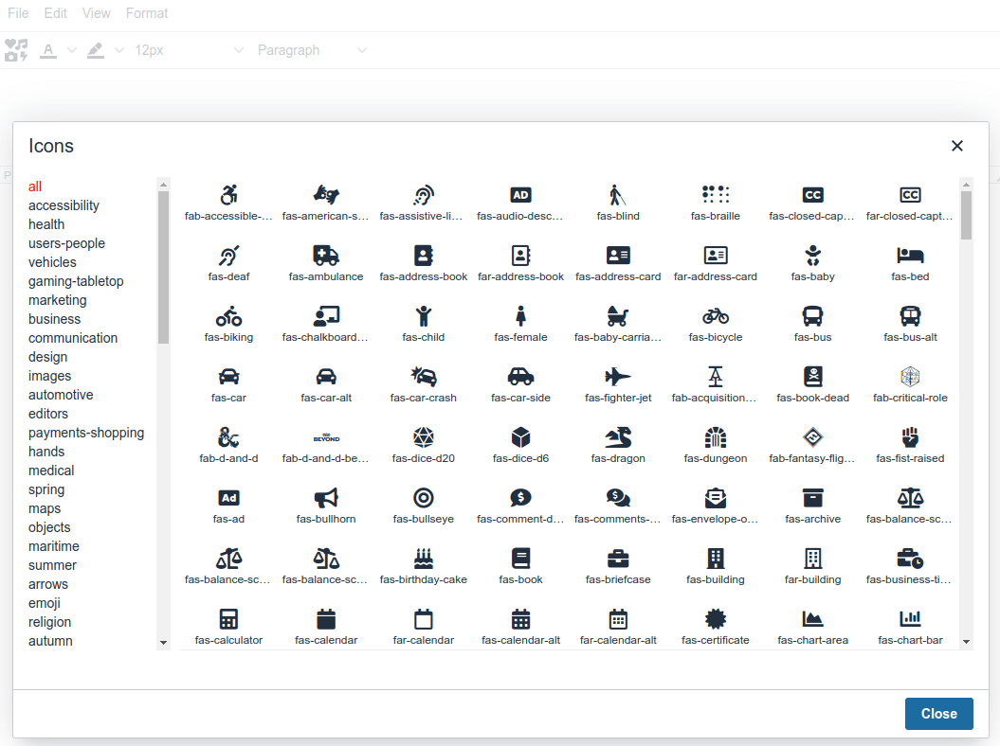

# tinymce-fontawesomepicker for Joomla 4
A plugin for `tinymce v5` that selects the `fontawesome` icon in Joomla 4 with the preinstalled fontawesome-free package.

Thank you very muth for this great plugin. I forked from [yoddag](https://github.com/yodagg/tinymce-fontawesomepicker) and only changed the url parameter to be hardcoded to target to the preinstalled Joomla 4 Fontawesome CSS.

[example](http://gitpages.wo2.me/tinymce-fontawesomepicker/)

# usage
- Move the `fontawesomepicker` folder to `media/vendor/tinymce/plugins`

- Settings in Joomla TinyMCE Plugin for `fontawesomepicker`


    
    ```


# preview


