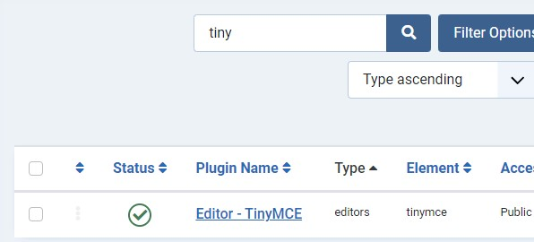
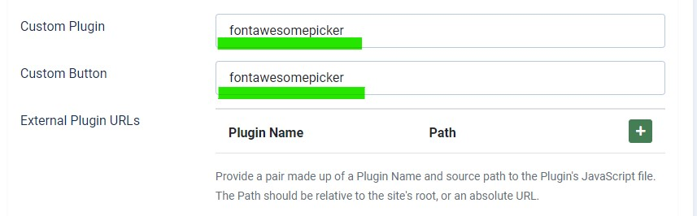

# tinymce-fontawesomepicker for Joomla 4
A plugin for `tinymce v5` that selects the `fontawesome` icon in Joomla 4 with the preinstalled fontawesome-free package.

Thank you very muth for this great plugin. I forked from [yoddag](https://github.com/yodagg/tinymce-fontawesomepicker) and only changed the url parameter to be hardcoded to target to the preinstalled Joomla 4 Fontawesome CSS.

Here you can see a complete [example](http://gitpages.wo2.me/tinymce-fontawesomepicker/)

# usage
- Move the `fontawesomepicker` folder to `media/vendor/tinymce/plugins`

- Settings in Joomla TinyMCE Plugin for `fontawesomepicker`
  - Open the setting from TinyMCE Plugin under plugins in Joomla 4
    
  - Add `span[class|style]` to the Extended Valid Elements
    
  - Add `fontawesomepicker` to the fields `Custom Plugin` and `Custom Button`
      
    
You can add this for all your defined Sets in the setting or just for some.
    ```

# preview


